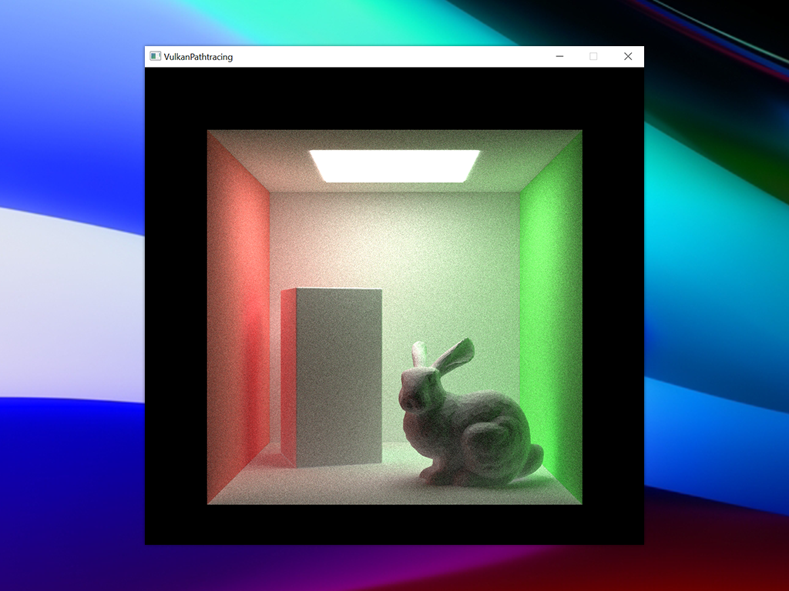

# Single File Vulkan Pathtracing

Minimal pathtracer using Vulkan RayTracing

# Environment

-   Vulkan SDK 1.2.162.0
-   GPU / Driver that support Vulkan Ray Tracing
-   C++17 or later

## Setup

See [vulkan-tutorial](http://vulkan-tutorial.com/)

# References

-   [NVIDIA Vulkan Ray Tracing Tutorial](https://nvpro-samples.github.io/vk_raytracing_tutorial_KHR/)
-   [Vulkan-Hpp](https://github.com/KhronosGroup/Vulkan-Hpp)
-   [Vulkan Tutorial](https://vulkan-tutorial.com/)
-   [SaschaWillems/Vulkan](https://github.com/SaschaWillems/Vulkan)
-   [vk_raytrace](https://github.com/nvpro-samples/vk_raytrace)
